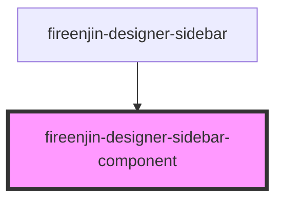

# fireenjin-designer-sidebar-component

<!-- Auto Generated Below -->

## Properties

| Property    | Attribute  | Description | Type                                                                                                                                                                                                                                                                                                                                                                                                                                 | Default     |
| ----------- | ---------- | ----------- | ------------------------------------------------------------------------------------------------------------------------------------------------------------------------------------------------------------------------------------------------------------------------------------------------------------------------------------------------------------------------------------------------------------------------------------ | ----------- |
| `component` | --         |             | `{ docs: string; docsTags: any[]; encapsulation: string; events: any[]; methods: any[]; presets: { id?: string; name?: string; description?: string; props?: any; }[]; props: { attr: string; default: any; docs: string; docsTags: any[]; mutable: boolean; name: string; optional: boolean; reflectToAttr: boolean; required: boolean; type: string; }[]; readme: string; slots: any[]; styles: any[]; tag: string; usage: any; }` | `undefined` |
| `host`      | `host`     |             | `string`                                                                                                                                                                                                                                                                                                                                                                                                                             | `undefined` |
| `useHash`   | `use-hash` |             | `boolean`                                                                                                                                                                                                                                                                                                                                                                                                                            | `false`     |

## Events

| Event            | Description | Type               |
| ---------------- | ----------- | ------------------ |
| `enjinSetPreset` |             | `CustomEvent<any>` |

## Dependencies

### Used by

 - [fireenjin-designer-sidebar](../sidebar)

### Graph

----------------------------------------------

*Built with [StencilJS](https://stenciljs.com/)*
